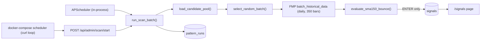
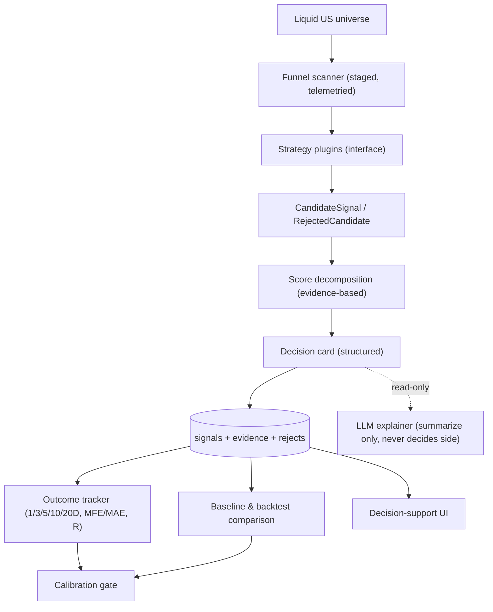

# Evidence Engine Architecture Plan

> Status: PROPOSED. Do not implement until explicitly approved.
> Author role: quant systems architect / product-minded CTO / skeptical due-diligence reviewer.
> Scope: `smart-scanner-be` (FastAPI) + `smart-scanner-ui` (Next.js) + Supabase/Postgres + FMP.

## 0. Guiding principle

**The architecture must prove signal value before adding complexity.**

We are NOT building an automated trading bot or a prediction engine. We are building a
**decision-support system**: it finds *fewer but better* candidate setups, explains *why*
they matter, compares them to *baselines*, tracks *outcomes*, and helps us learn whether the
signal logic actually adds value.

Every phase below is gated: we do not enable a complex strategy for production alerts until it
has beaten baselines on a fixed universe with an adequate sample size.

---

## 1. Current-state audit (verified in code)

### 1.1 Data flow today



### 1.2 Confirmed blockers and defects

| # | Severity | Issue | Evidence |
|---|----------|-------|----------|
| B1 | High | `get_pattern_config()` exists but is never called; DB config has no effect on evaluation | `persistence.py:205`, no callers in `scan_runner.py`/`sma150.py` |
| B2 | High | `score_components` persisted as `score * weight` (not measured values) | `sma150.py:324-329` |
| B3 | High | Random batch scanning; no funnel; no MTF evidence | `tickers.py:311 select_random_batch`, `scan_runner.py:399` |
| B4 | High | No `side` (LONG/SHORT); only ENTER/AVOID | `sma150.py`, `signals` schema |
| B5 | High | Reject telemetry is aggregate counts only; rejected symbols/reasons not persisted | `pattern_runs` schema, `persistence.py:154` |
| B6 | Med | Duplicate scheduler: APScheduler (`ENABLE_SCHEDULER=True`) + docker `scheduler` curl loop | `main.py:28`, `docker-compose.yml:24-53` |
| B7 | Med | `run_maintenance_tasks()` uses `async with get_db()` on an async generator → job always fails | `scan_runner.py:557`, `deps.py:51` |
| B8 | Med | UI health calls `/api/health`; backend serves `/health` → settings always shows unhealthy | `lib/api.ts:12-13,71`, `main.py:64` |
| B9 | Med | `filter_by_liquidity` computes `estimated_market_cap` but never uses it; market-cap filter not enforced | `tickers.py:369-381` |
| B10 | Med | `tickers.last_volume` is fabricated from market_cap/price, not real volume | `tickers.py:97-101` |
| B11 | Med | `get_db_connection()` does `pool.acquire()` then `conn.close()` (closes pooled conns instead of releasing) | `persistence.py:38-41,104` |
| B12 | Med | Algorithm is deliberately over-permissive (15% proximity, threshold 0.1, min_bounces 1) → noise | `sma150.py:20-31,294` |
| B13 | Low | No tests, no lockfile, no `.env.template`, no `.gitignore` | repo root |
| B14 | Low | WebSocket scan state is process-local; breaks across restart/multi-worker | `utils/events.py`, admin WS |
| B15 | Low | `signals` unique on `(symbol, pattern_code, snapshot_date)` → re-scans overwrite same day, no history | `001_initial_schema.sql:39` |

### 1.3 What already works (keep)

- FMP client with rate limiting + retry/backoff (`fmp_client.py`).
- Async batch historical fetch (`batch_historical_data`).
- Indicator + dataframe validation utilities (`indicators.py`).
- Signal persistence + pattern-run telemetry plumbing (extend, don't rewrite).
- Next.js signals dashboard, drawer, realtime provider (extend, don't redesign).

---

## 2. Target architecture: the Evidence Engine

The core is a **strategy-agnostic Evidence Engine**. Strategies are plugins. The engine owns the
funnel, evidence collection, scoring decomposition, decision cards, and outcome tracking.
Wyckoff MTF is just one plugin among several baselines.



Ordering rationale (differs from the earlier Wyckoff-first plan): **outcome tracking and
baselines come before the complex strategy**, so we can measure whether any strategy is worth
enabling. Wyckoff is Phase 5, not Phase 1.

---

## 3. Data model proposal

New/changed tables (new migration `002_evidence_engine.sql`; keep `001` intact).

### 3.1 `signals` (extend, do not break)

Add nullable columns so existing rows survive:

- `strategy_code TEXT` (alias of `pattern_code`; keep `pattern_code` for back-compat)
- `side TEXT` — `LONG` | `SHORT` | `NEUTRAL`
- `setup_type TEXT` — e.g. `spring`, `sos`, `range_breakout`, `sma150_bounce`
- `timeframe TEXT` — decision timeframe, e.g. `1D`, `4H`
- `entry_trigger TEXT` — human/structured trigger description
- `entry_price NUMERIC`, `stop_price NUMERIC`, `target_price NUMERIC`
- `invalidation TEXT`
- `expected_holding_days INT`
- `market_regime TEXT` — regime at signal time (see 3.5)
- `sector TEXT` (nullable; only if FMP profile available)
- `score_version TEXT` — formula version string
- `evidence JSONB` — raw measured components (see Section 5)
- `decision_card JSONB` — structured card (see Section 6)
- `status TEXT` — `ENTER` | `WATCH` | `AVOID`

Change uniqueness to preserve history:
`UNIQUE(symbol, strategy_code, snapshot_date, timeframe)` and add a `scan_run_id UUID` FK.

### 3.2 `scan_runs` (replace/extend `pattern_runs`)

Keep `pattern_runs` for back-compat; add a richer `scan_runs`:

- `id UUID PK`, `strategy_code TEXT`, `started_at`, `finished_at`
- `universe_size INT`, `enter_count INT`, `watch_count INT`, `rejected_count INT`, `error_count INT`
- `api_calls INT`, `runtime_seconds NUMERIC`
- `config_snapshot JSONB` — exact config used (for reproducibility)
- `stage_telemetry JSONB` — per-stage funnel metrics (Section 4.2)

### 3.3 `scan_rejects` (new, lightweight)

Per-candidate rejection facts (sampled or full, controlled by flag):

- `id UUID`, `scan_run_id UUID`, `symbol TEXT`, `strategy_code TEXT`
- `stage TEXT` — which funnel stage rejected it
- `reason TEXT`, `metrics JSONB`, `created_at`

Guarded by `DEBUG_SAVE_REJECTS` and a sampling cap (e.g. store top-N reasons + N sample symbols per run) to avoid unbounded writes.

### 3.4 `signal_outcomes` (new — the heart of proving value)

One row per signal, updated as horizons mature:

- `signal_id UUID FK`, `symbol`, `strategy_code`, `side`, `snapshot_date`, `timeframe`
- `entry_price`, `stop_price`, `target_price`
- `ret_1d, ret_3d, ret_5d, ret_10d, ret_20d NUMERIC`
- `mfe NUMERIC` (max favorable excursion), `mae NUMERIC` (max adverse excursion)
- `hit_stop BOOLEAN`, `hit_target BOOLEAN`, `bars_to_exit INT`
- `realized_r NUMERIC` (simulated R using entry/stop)
- `bench_ret_1d..20d NUMERIC` (SPY/QQQ same window)
- `ticker_bh_ret_1d..20d NUMERIC` (buy&hold same ticker)
- `evaluated_through DATE` (how far outcomes are computed)

### 3.5 `market_regime` (new, small)

Daily snapshot to attach regime context:

- `as_of_date DATE PK`, `spy_above_200sma BOOLEAN`, `spy_20d_slope NUMERIC`
- `vix_level NUMERIC` (if available via FMP), `regime_label TEXT` (`risk_on`/`risk_off`/`neutral`)

### 3.6 `backtests` (reuse existing table, extend)

Existing `backtests` table stays; add columns:

- `baseline_code TEXT`, `expectancy NUMERIC`, `avg_r NUMERIC`, `profit_factor NUMERIC`
- `max_drawdown NUMERIC`, `sample_size INT`, `win_rate NUMERIC`, `notes JSONB`

---

## 4. Funnel scanner design

Replace `select_random_batch` as the default with a deterministic, telemetried funnel.
Random sampling remains available only behind a flag for smoke testing.

### 4.1 Stages

| Stage | Purpose | Data cost | Typical survivors |
|-------|---------|-----------|-------------------|
| 0 | Build liquid US universe (screener: cap/volume/exchange; real volume) | 1 screener call | ~1–3k |
| 1 | Cheap filters (price floor, tradability, exclude ETF/FUND/REIT) | none (metadata) | ~60–80% |
| 2 | Daily-level filtering (trend/structure prefilter per strategy) | daily fetch | ~10–30% |
| 3 | Strategy-specific setup detection (deterministic rules) | reuse daily | tens–hundreds |
| 4 | Expensive data only for survivors (e.g. 4H) | 4H fetch (few) | small |
| 5 | Final `ENTER` / `WATCH` + evidence + decision card | none | few |

### 4.2 Per-stage telemetry (persist in `scan_runs.stage_telemetry`)

For each stage: `received`, `passed`, `rejected`, `top_rejection_reasons[]`,
`api_calls`, `runtime_seconds`, `sample_rejected_symbols[]`, `strategy_notes`.

### 4.3 Files affected

- `smart-scanner-be/app/workers/funnel.py` (new): stage orchestration + telemetry accumulator.
- `smart-scanner-be/app/workers/tickers.py`: fix `filter_by_liquidity` (enforce/remove market-cap; use real volume), add universe builder using screener volume.
- `smart-scanner-be/app/workers/scan_runner.py`: call funnel instead of random batch by default; write `scan_runs` + `scan_rejects`.

---

## 5. Scoring: evidence-based only

No arbitrary 0–100. A score exists only if decomposable into **measured** components,
each persisted as raw values plus a `score_version`.

Components (per candidate, in `signals.evidence`):

- `data_quality` — bars available, missing-bar ratio, staleness, outlier flags.
- `setup_quality` — measured setup strength (e.g. proximity %, breakout distance in ATR).
- `risk_quality` — R multiple available to stop, ATR-normalized stop distance.
- `historical_evidence` — count + quality of prior analogous setups on this symbol.
- `confluence` — agreement across timeframes (only if strategy is MTF).
- `catalyst_risk` — earnings/news proximity (only if that data is wired; else omitted, not faked).

Persist **raw measured values and the formula version**, not `score * weight`.
The composite (if any) is derived at read time or stored alongside raw values with the formula id.

Fix B2: replace the `score * weight` block in `sma150.py` with the actual per-component measurements returned by `calculate_score`.

---

## 6. Decision cards

Every `ENTER`/`WATCH` emits a structured `decision_card` (JSONB), generated from
**structured data only**. Fields:

- `setup` — what the setup is (setup_type + timeframe)
- `why_now` — the triggering measurement(s)
- `bias` — LONG/SHORT/NEUTRAL (from deterministic engine)
- `entry_trigger`, `confirmation`, `invalidation`
- `stop`, `expected_holding_window`
- `supporting_evidence[]` — raw measurements that support it
- `contradicting_evidence[]` — measurements against it
- `baseline_comparison` — latest backtest expectancy vs baselines
- `watch_next[]` — what to monitor

### 6.1 LLM role (strictly bounded)

The LLM MAY: summarize structured evidence, phrase reasoning, surface contradictions,
summarize news/earnings if present, render a human-readable card from verified inputs,
compare candidates.

The LLM MUST NOT: decide `side`, invent reasons, or produce numbers not present in the
structured inputs. `side` is always set by the deterministic strategy engine. (LLM wiring is
optional and gated to a later phase; the card is fully functional without it.)

---

## 7. Strategy interface proposal

A single contract all strategies implement. Location: `smart-scanner-be/app/strategies/base.py`.

```python
class StrategyResult:  # CandidateSignal | RejectedCandidate
    ...

class Strategy(Protocol):
    code: str                      # e.g. "sma150_bounce", "wyckoff_mtf"
    def config_schema(self) -> dict: ...          # keys + types + defaults
    def required_timeframes(self) -> list[str]: ... # e.g. ["1D"] or ["1M","1W","1D","4H"]
    def prefilter_daily(self, df) -> bool: ...     # Stage 2 cheap gate
    def evaluate(self, ctx: EvalContext) -> StrategyResult: ...  # Stage 3/5
    def score_components(self, ctx) -> dict: ...   # raw measured values
    def decision_card(self, result) -> dict: ...   # structured card fields
    def backtest_settings(self) -> dict: ...       # entry/exit/horizon rules
```

- `sma150_bounce` migrates into this interface as a **baseline** strategy, disabled by default for production alerts if noisy (B12).
- `wyckoff_mtf` is a future implementation of the same interface.
- A registry (`app/strategies/registry.py`) maps `code -> Strategy`, replacing the `if pattern_code == ...` branches in `scan_runner.py`.
- `get_pattern_config()` is wired here: engine loads DB config, validates against `config_schema()`, and passes it into `evaluate` (fixes B1).

---

## 8. Backtest & outcome tracking proposal

### 8.1 Outcome tracker (Phase 2, early)

A scheduled job computes forward returns for matured signals:

- Fetch daily bars after `snapshot_date`; compute `ret_{1,3,5,10,20}d`, `mfe`, `mae`.
- Simulate stop/target if defined; compute `realized_r`, `hit_stop`, `hit_target`, `bars_to_exit`.
- Fetch SPY/QQQ + same-ticker buy&hold for identical windows.
- Upsert into `signal_outcomes`; advance `evaluated_through`.

Location: `smart-scanner-be/app/workers/outcomes.py`.

### 8.2 Baselines (must exist before trusting any strategy)

Implemented as strategies/generators over the same universe + windows:

- Buy & hold SPY/QQQ over holding window.
- Buy & hold same ticker over holding window.
- Simple momentum (e.g. 20/50 SMA cross or 3-month return rank).
- Simple mean-reversion (e.g. RSI< X near support) where relevant.
- Random same-sector candidate (only if sector data available).
- Current `sma150_bounce`.

### 8.3 Metrics (no single win-rate worship)

Report per strategy vs each baseline: **expectancy, avg R, profit factor, max drawdown,
sample size, win rate, and delta vs baseline.** A strategy is "useful" only if it beats
baselines on expectancy/avg-R with adequate sample size.

Location: `smart-scanner-be/app/workers/backtest.py` (harness) + `app/routers/public.py` (read endpoints).

---

## 9. Data architecture (FMP + timeframes)

- Daily remains the primary source (existing endpoint).
- Weekly/monthly are **derived by resampling daily** (no separate endpoint).
- 4H fetched only for funnel survivors, via `/historical-chart/4hour/{symbol}`.
- Per-scan-run cache to avoid duplicate calls (keyed by symbol+timeframe).
- Data-quality checks: missing bars, stale last price, split anomalies, extreme outlier candles, insufficient history.

New util `smart-scanner-be/app/workers/timeframes.py` (only if resampling/caching justifies it):
resample daily→weekly/monthly, normalize OHLCV schema, validate history length, per-run cache.

FMP client changes (`fmp_client.py`): add `get_intraday_4h(symbol)`; keep daily as-is; add
optional `from/to` params; centralize base-url handling for the intraday (`/stable` vs `/v3`) path.

---

## 10. Required infrastructure fixes (Phase 1)

- Wire `get_pattern_config()` into every strategy evaluation via the registry (B1).
- Fix `score_components` persistence to raw measured values + `score_version` (B2).
- Align health: change UI to call `/health` (or add `/api/health` alias in backend). Chosen: add `GET /api/health` alias in FastAPI to match the UI's `apiRequest` prefix, least UI churn (B8).
- Single authoritative scheduler: keep in-process APScheduler; delete the docker-compose `scheduler` curl service (B6).
- Fix `run_maintenance_tasks()` to iterate the async generator properly (`async for db in get_db():` or acquire from pool) (B7).
- Fix `get_db_connection()` to release connections to the pool, not `close()` them (B11).
- Add feature flags: `ENABLE_FUNNEL_SCAN`, `ENABLE_WYCKOFF`, per-strategy `is_enabled` (config + DB).
- Add `DEBUG_SAVE_REJECTS` + `scan_rejects` table (B5).
- Enforce or remove the market-cap filter in `filter_by_liquidity`; use real screener volume for `last_volume` (B9, B10).
- Add tests (Section 12).

---

## 11. UI requirements (extend, do not redesign)

Files: `app/signals/page.tsx`, `components/signals/SignalTable.tsx`,
`components/signals/SignalDrawer.tsx`, `lib/api.ts`, plus a new `TelemetryDrawer`.

- Filters: `side` (LONG/SHORT/WATCH), strategy, timeframe, setup type, score/evidence status.
- Decision-card drawer (structured card from `decision_card` JSONB).
- MTF summary panel (only populated for MTF strategies).
- Show reason + invalidation prominently.
- Badge whether a signal has historical evidence (from `evidence.historical_evidence`).
- Outcome tracking view once `signal_outcomes` populated (1/3/5/10/20D, R, vs benchmark).
- Funnel run telemetry view from `scan_runs.stage_telemetry`.
- Fix `lib/api.ts` health path; add typed fields for new signal columns.

---

## 12. Tests to add

Backend (`smart-scanner-be/tests/`, pytest):

- `test_timeframes.py` — daily→weekly/monthly resampling correctness; OHLCV normalization; history-length validation.
- `test_strategy_interface.py` — registry resolves codes; config validated against schema; `sma150_bounce` adapter returns structured result + raw score components.
- `test_scoring.py` — score components are raw measured values, not `score*weight`; `score_version` present.
- `test_funnel.py` — stage telemetry accounting (received/passed/rejected sums), rejects persisted under flag, no random batch by default.
- `test_outcomes.py` — forward-return math (1/3/5/10/20D), MFE/MAE, realized R, benchmark alignment; matured-vs-immature handling.
- `test_backtest_baselines.py` — expectancy/avg-R/profit-factor/drawdown computed; strategy-vs-baseline delta.
- `test_config_wiring.py` — DB `pattern_configs` actually change evaluation output.
- `test_maintenance.py` — `run_maintenance_tasks` runs without the async-generator misuse.

Frontend (`smart-scanner-ui`): component tests for filters and decision-card rendering; api health-path test.

---

## 13. Phase-by-phase checklist

### Phase 0 — Audit & architecture correction (this document)
- [x] Inspect backend, DB, UI, scheduler, FMP usage
- [x] Document current flow + blockers
- [ ] Approve this plan (no feature implementation yet)

### Phase 1 — Foundation & correctness
- [x] Wire `get_pattern_config` into evaluation (B1)
- [x] Fix `score_components` persistence (B2)
- [x] Add `/api/health` alias; UI health works (B8)
- [x] Remove docker `scheduler` service; APScheduler authoritative (B6)
- [x] Fix `run_maintenance_tasks` async-generator misuse (B7)
- [x] Fix `get_db_connection` pool release (B11)
- [x] Stricter, config-driven `sma150_bounce` thresholds (B12) via `002` migration
- [x] Deduplicated bounce counting
- [x] Real market-cap/volume filtering (B9/B10)
- [x] Minimal reject telemetry in `pattern_runs.notes` (lightweight; full `scan_rejects` table deferred to Phase 3)
- [x] Tests: bounce dedup, score_components, config wiring, config resolver, liquidity filter, health route
- [ ] (Deferred to Phase 2/3) `signals` schema enrichment, `scan_rejects` table + `DEBUG_SAVE_REJECTS`, feature flags

### Phase 2 — Evidence & outcome tracking
- [x] `signal_outcomes` table (migration `003_phase2_signal_outcomes.sql`). `market_regime` deferred.
- [x] Outcome tracker service (1/3/5/10/20D returns, MFE/MAE, stop/target hits, simplified R)
- [x] Baselines implemented: same-ticker B&H, SPY B&H, QQQ B&H (momentum/mean-reversion/random-sector deferred)
- [x] Metrics: sample size, win rate, avg/median return, avg R, profit factor, avg MFE/MAE, baseline deltas
- [x] Comparison endpoints (`GET /api/outcomes`, `GET /api/outcomes/metrics`, `POST /api/admin/outcomes/calculate`) + tests
- [ ] Full backtest harness over historical universe (deferred; outcome tracking of live signals first)

### Phase 3 — Funnel scanner
- [x] Liquid universe builder (real volume, from ticker cache; NULLs preserved)
- [x] Deterministic staged filtering + telemetry (`app/workers/scanner/funnel.py`)
- [x] Funnel available behind `scanner_mode=funnel`; legacy random remains default (flip default later)
- [x] Expensive data (4H) hook present but disabled (`enable_expensive_stages=false`)
- [x] Staged telemetry persisted in `pattern_runs.notes` (no migration) + tests

### Phase 4 — Strategy interface
- [x] `Strategy` contract + enums (`StrategyDecision`, `StrategySide`), `StrategyContext`, `StrategyResult` (`app/workers/strategies/base.py`)
- [x] Static registry `get_strategy` / `list_strategies` / `register_strategy` with clear `UnknownStrategyError` (`app/workers/strategies/registry.py`)
- [x] `sma150_bounce` wrapped behind the contract without behavior change (`app/workers/strategies/sma150_adapter.py`)
- [x] Funnel Stage 3 evaluates through the registry (no direct sma150 import); legacy `scan_runner` preserved unchanged
- [ ] Prepare `wyckoff_mtf` skeleton behind flag + tests (Phase 5)

**Implementation notes (Phase 4):**
- The interface is deliberately small and typed. `StrategyResult` carries
  `decision/side/score/reason/rejection_reason/details/score_components` plus
  optional `entry_price/stop_price/target_price/invalidation/setup_type` and
  `required_timeframes`/`strategy_version` for future strategies.
- **sma150 behavior is unchanged.** The adapter calls the existing
  `evaluate_sma150_bounce` and repackages the result; persisted `details` are
  byte-identical, so the UI and Phase 2 outcome tracking see the same payload.
- **Side decision:** sma150_bounce is a long-only rebound setup and Phase 2
  outcome tracking already defaults these signals to LONG. We expose
  `side=LONG` at the interface level but do NOT inject side/stop/target into the
  persisted `details` (nothing invented). Formal per-strategy direction/stop/
  target lives with future strategies (Wyckoff MTF, Phase 5).
- Legacy `scan_runner` still calls sma150 directly (kept working, low risk);
  routing it through the registry is optional and deferred.
- See `docs/phase-4-strategy-interface-summary.md`.

### Phase 5 — Wyckoff MTF v1 (deterministic only)
- [x] Timeframe utils (`app/workers/timeframes.py`): normalize + daily→weekly (`W-FRI`) / monthly (`ME`) preserving OHLCV semantics
- [x] Monthly macro bias (SMA20 + slope + no 3 consecutive lower-lows/higher-highs; reject NEUTRAL)
- [x] Weekly alignment + rough phase (accumulation/markup/distribution/markdown/unknown; reject conflict)
- [x] Daily setup detection with explicit measurable rules (spring/SOS/range_breakout for LONG; utad/SOW/range_breakdown for SHORT)
- [x] 4H trigger only when enabled AND data injected; explicit LONG/SHORT + entry/stop/invalidation. If no 4H → WATCH (not ENTER)
- [x] `wyckoff_mtf` behind the Phase 4 Strategy interface + registry; funnel evaluates it via the registry (opt-in, non-default)
- [x] Migration `004_phase5_wyckoff_mtf_config.sql` (registers pattern DISABLED + config; additive/idempotent)
- [x] Deterministic tests for every rule + strategy WATCH/ENTER + funnel integration (`tests/test_wyckoff_mtf.py`)
- [ ] LPS/LPSY and other subjective/effort-vs-result reads — OUT OF SCOPE (documented as future)

**Implementation notes (Phase 5):**
- **No live 4H fetch.** The FMP client has no intraday endpoint, so 4H is never
  fetched automatically. The strategy uses 4H only when the caller injects it via
  `StrategyContext.data_meta["df_4h"]` and `enable_4h_trigger` is true. Through
  the funnel (expensive stages disabled) wyckoff yields at most WATCH.
- Score is a decomposed `structure_score` (0..1) from raw components
  (`monthly_bias_quality`, `weekly_alignment_quality`, `daily_setup_quality`,
  `volume_confirmation`); the 4H trigger only flips WATCH↔ENTER. No 0-100 score.
- wyckoff needs deep daily history (≥ ~540 bars for ≥24 monthly bars). The funnel
  sizes the bounded history fetch + cheap prefilter from `strategy.min_daily_bars`.
- Signals (when created) carry `side`, `entry_price`/`stop_price`/`invalidation`,
  `setup_type`, and a timeframe summary in `details` for Phase 2 outcome tracking.
- See `docs/phase-5-wyckoff-mtf-summary.md`.

### Phase 6 — Decision cards & UI
- [ ] Structured decision card generation (data-driven)
- [ ] Signal drawer + filters + MTF context
- [ ] Backtest/outcome visibility + funnel telemetry view

### Phase 7 — Calibration gate
- [ ] Run on fixed symbol universe
- [ ] Compare to baselines; require minimum sample size
- [ ] Tune only via `pattern_configs`
- [ ] Written go/no-go: is the strategy worth continuing?

---

## 14. Risk register

| Risk | Likelihood | Impact | Mitigation |
|------|-----------|--------|------------|
| Survivorship / look-ahead bias in backtest | High | High | Use point-in-time universe; only bars strictly after snapshot; freeze config snapshot per run |
| Small sample size → false confidence | High | High | Enforce minimum sample-size gate before "useful" verdict; report confidence intervals |
| FMP data quality (splits, gaps, stale) | Med | High | Data-quality checks in Section 9; reject low-quality candidates with reason |
| FMP rate limits / 4H cost | Med | Med | 4H only for survivors; per-run cache; existing rate limiter |
| Over-engineering the engine before value proven | Med | High | Phase gating; Wyckoff deferred to Phase 5; baselines first |
| Subjective Wyckoff rules resist deterministic coding | High | Med | Mark subjective rules out of scope; use measurable substitutes |
| Schema migration breaks existing signals | Low | Med | Additive nullable columns; keep `001`; new `002` migration |
| LLM hallucinating reasons/side | Med | High | LLM is explain-only; side is deterministic; card built from structured data |
| Dual scheduler double-runs / cost | Med | Med | Remove docker scheduler in Phase 1 |
| Connection-pool exhaustion (B11) | Med | Med | Fix pool release early in Phase 1 |

---

## 15. Exact files likely to change

Backend:
- `app/config.py` — feature flags, `DEBUG_SAVE_REJECTS`.
- `app/deps.py` — pool release fix.
- `app/db/migrations/002_evidence_engine.sql` (new).
- `app/strategies/base.py`, `app/strategies/registry.py`, `app/strategies/sma150.py` (adapter), `app/strategies/wyckoff/*` (new).
- `app/workers/scan_runner.py` — funnel dispatch, scan_runs/scan_rejects, remove `if pattern_code` branches.
- `app/workers/funnel.py` (new), `app/workers/timeframes.py` (new), `app/workers/outcomes.py` (new), `app/workers/backtest.py` (new).
- `app/workers/tickers.py` — liquidity/volume fixes.
- `app/workers/fmp_client.py` — 4H endpoint, from/to.
- `app/workers/scan_runner.py` `run_maintenance_tasks` — async-gen fix.
- `app/workers/persistence.py` — new tables, score_components fix, get_db_connection fix.
- `main.py` — `/api/health` alias.
- `docker-compose.yml` — remove `scheduler` service.
- `tests/*` (new).

Frontend:
- `lib/api.ts` — health path + new signal fields.
- `lib/supabase.ts` — types for new columns.
- `app/signals/page.tsx` — filters, telemetry.
- `components/signals/SignalTable.tsx`, `SignalDrawer.tsx` — side/setup/evidence, decision card.
- `components/signals/TelemetryDrawer.tsx` (new).

---

## 16. Definition of success (measurable)

- Fewer `ENTER` signals than current `sma150_bounce`.
- Every `ENTER` has: side, setup type, entry, stop, invalidation, timeframe context, reason.
- Every strategy is comparable against baselines (expectancy/avg-R/profit-factor/drawdown/sample size).
- Every scan run has full funnel telemetry.
- Every candidate can be evaluated later via `signal_outcomes`.
- No complex strategy is enabled by default without historical evidence beating baselines.
- UI helps make decisions (filters + decision cards + outcomes), not just displays alerts.

---

## 17. Explicit recommendation

**Implement first (highest value, lowest risk):**
1. Phase 1 correctness fixes (B1, B2, B6, B7, B8, B11) — small, unblock everything, cheap.
2. Phase 2 outcome tracking + baselines — this is what proves value; do it before Wyckoff.

**Postpone:**
- Wyckoff MTF (Phase 5) until baselines + outcomes exist and the funnel is trustworthy.
- LLM explainer wiring until decision cards are structurally complete.
- 4H intraday fetching until the funnel produces a small survivor set.

**Delete / disable:**
- Delete docker-compose `scheduler` curl service (duplicate).
- Disable `sma150_bounce` production alerts by default once baselines confirm it is noisy; keep it enabled as a **baseline** for comparison only.
- Remove the fabricated `estimated_volume`/`estimated_market_cap` code paths; replace with real screener values or delete the dead branch.
- Do not build: automated order execution, price prediction, arbitrary 0–100 scores, LLM-decided direction.

---

## 18. Phase 1 implementation notes (DONE)

Phase 1 (foundation & correctness) is implemented. Full details in
`docs/phase-1-foundation-summary.md`. Summary:

- B1 wired: DB `pattern_configs` resolved and passed into evaluation via new
  `app/workers/patterns/config.py`; safe-default fallback is logged.
- B2 fixed: `score_components` persist RAW measured values + `score_version`
  (no more `score * weight`).
- B11 fixed: pooled connections are released, not closed.
- B12 fixed: stricter, config-driven `sma150_bounce` thresholds
  (migration `002_phase1_sma150_config.sql`).
- Bounce counting deduplicated (contiguous in-band run = one event).
- B9/B10 fixed: real volume from the FMP screener; `filter_by_liquidity`
  enforces real avg volume/price and returns a reason; no fabricated values.
- B6 fixed: docker `scheduler` service removed; APScheduler is authoritative.
- B7 fixed: `run_maintenance_tasks` acquires/releases a pooled connection.
- B8 fixed: `/api/health` alias added.
- Reject telemetry foundation: JSON in `pattern_runs.notes` (no new schema).
- 23 tests added and passing (bounce dedup, score_components, config wiring,
  config resolver, liquidity filter, health route).

Not done (by design, deferred to later phases): funnel scanner, outcome
tracking, backtests/baselines, strategy interface, Wyckoff, LLM, UI redesign.

---

## 19. Phase 2 implementation notes (DONE)

Phase 2 (outcome tracking + baseline comparison) is implemented. Full details in
`docs/phase-2-outcome-tracking-summary.md`. Summary:

- New `signal_outcomes` table (migration `003_phase2_signal_outcomes.sql`): one
  row per signal, side-adjusted per-window returns as explicit columns
  (`ret_1d..ret_20d`), baseline breakdowns as JSONB, MFE/MAE, stop/target hits,
  simplified R, and an `outcome_status` lifecycle.
- Pure, unit-tested numeric core in `app/workers/outcomes/`:
  `calculator.py` (returns, MFE/MAE, stop/target, R), `baselines.py`
  (buy&hold + deltas), `metrics.py` (aggregation).
- I/O layers: `persistence.py` (CRUD, load-signals-needing-outcomes) and
  `service.py` (fetch OHLCV + SPY/QQQ, build records, persist; never aborts on a
  single-symbol failure).
- Endpoints: read-only `GET /api/outcomes`, `GET /api/outcomes/metrics`; admin
  `POST /api/admin/outcomes/calculate` (worker-token protected, bounded by
  `limit`, NOT scheduled).
- 33 new tests (56 total) covering forward returns (LONG/SHORT), MFE/MAE,
  stop/target, simplified R, baselines, aggregation metrics, missing/insufficient
  data, and route registration.

Deferred by design: `market_regime` table, full historical backtest harness,
extra baselines (momentum/mean-reversion/random-sector), any UI, and any change
to signal-generation logic.

Known validation debt (carried from Phase 1): the controlled single-symbol scan
smoke was intentionally skipped before Phase 2. Outcome tracking has been proven
on synthetic data via unit tests, but has NOT yet been run end-to-end against
real generated signals + live FMP data. This remains open and should be closed
before drawing any conclusions about signal value.

---

## 20. Phase 3 implementation notes (DONE)

Phase 3 (hierarchical funnel scanner) is implemented. Full details in
`docs/phase-3-funnel-scanner-summary.md`. Summary:

- New `app/workers/scanner/funnel.py`: staged funnel with pure, unit-tested
  classifiers (`classify_liquidity`, `cheap_prefilter`), a `RejectionTracker`
  (capped samples), telemetry assembly, and an async orchestrator
  `run_funnel_scan(...)`.
- Stage 0 universe from the ticker cache via new read-only
  `get_universe_tickers()` (real values, NULLs preserved — no fabrication).
- Stage 1 liquidity filter runs BEFORE any FMP history fetch; Stage 2 cheap
  daily prefilters; Stage 3 strategy evaluation on survivors only (reuses the
  Phase 1 config resolver + `evaluate_sma150_bounce`). Stage 4 (4H/expensive) is
  a documented, disabled no-op hook.
- Telemetry (scanner_version, config_summary, stage_counts,
  rejection_reason_counts, capped sample_rejections, api_call_counts, timings)
  persisted as JSON in `pattern_runs.notes` — no migration needed.
- Admin `POST /api/admin/scan/start` gains `scanner_mode` (`legacy` default |
  `funnel`), `limit`, and `dry_run`. `dry_run` runs Stages 0-1 only: no FMP, no
  writes, returns telemetry synchronously (safe validation path). Legacy random
  scan is unchanged and remains the default.
- New signals from the funnel go through the existing `save_signal` pipeline, so
  they are automatically Phase 2 outcome-tracking compatible. `side` is NOT
  invented for `sma150_bounce`; it stays absent (outcome tracking defaults LONG).
- 19 new tests (75 total), all deterministic — no live FMP/Supabase.

Deferred by design: making funnel the default, `scan_rejects` table, real 4H
data, extra baselines, strategy interface, Wyckoff, LLM, UI.
